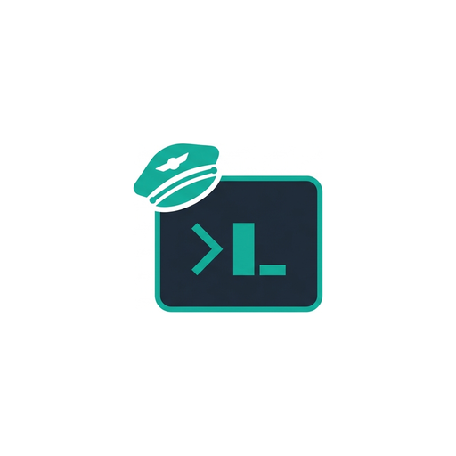

<p align="center">
  
</p>

# PiloTY

PiloTY (PTY for your AI Copilot) is an MCP server that gives an agent a persistent, interactive terminal.

If you have used Claude Code / Codex to run shell commands, you have probably hit the same wall: tool calls tend to be stateless. Each call starts "fresh", so environment variables disappear, interactive programs cannot be driven reliably, and long-running processes get cut off or orphaned while the agent is thinking.

PiloTY exists to make the agent's terminal behave more like a human's: start something in a real terminal, come back later, and keep going.

Warning: PiloTY exposes unrestricted terminal access. Treat it like giving the agent your keyboard.

## What it enables

- Long-running commands: builds, installs, migrations, test suites. Start once, check output later.
- Log monitoring: `tail -f`, `journalctl -f`, `kubectl logs -f`, CI logs, service restarts.
- "Vibe debugging": keep a REPL/debugger open while the agent reads code and tries ideas (`python`, `ipython`, `pdb`).
- Privileged operations: handle interactive password prompts (`sudo`, SSH passwords, key passphrases).
- SSH-based devops: keep a remote login session alive across tool calls; run remote commands in the same shell.
- Terminal UIs: `less`, `man`, `top`, `vim` can work, but cursor-heavy programs often require screen snapshots instead of plain text output.

## Quickstart

PiloTY is meant to be launched by an MCP client over stdio.

Add it to Codex CLI as an MCP server:

```bash
codex mcp add piloty -- uvx --from git+https://github.com/yiwenlu66/PiloTY.git piloty
```

If you prefer SSH-based Git fetch:

```bash
codex mcp add piloty -- uvx --from git+ssh://git@github.com/yiwenlu66/PiloTY.git piloty
```

If you already have a local clone:

```bash
codex mcp add piloty -- uv --directory /path/to/PiloTY run piloty
```

Run the server command directly (without adding it to an MCP client):

```bash
uvx --from git+https://github.com/yiwenlu66/PiloTY.git piloty
```

## Mental model

One session is one real interactive terminal that stays alive across tool calls.

- State persists: cwd, environment variables, foreground process, remote SSH connection, REPL/debugger state.
- PiloTY tracks both the raw output stream and a rendered screen/scrollback view.

PiloTY keeps two representations:

- `output`: incremental text stream (optionally ANSI-stripped)
- Rendered screen/scrollback: what a human would see in a terminal

Sessions are addressed by a `session_id` string. Reusing the same id is what keeps state.

## Integration notes (for MCP integrators)

MCP does not expose a standard "client cwd" field, so the first step is always to create a session with an explicit working directory, then reuse the same `session_id` for subsequent calls.

Typical agent workflow:

- Create a session (explicit cwd) and reuse the same `session_id`.
- Run commands, poll for output, and send raw input/control keys for interactive programs.
- For cursor-heavy TUIs, rely on rendered screen snapshots/scrollback rather than plain text output.
- Use `expect_prompt` after `ssh` or other login flows where the prompt appears later.
- If prompt detection is wrong (looks idle at a prompt but status stays "running"), configure a custom shell-prompt regex.
- Use `send_password` for secret entry; terminate the session when done.

For exact tool names, arguments, and return fields, use your MCP client's tool schema or read `piloty/mcp_server.py`.

## Limitations

- Status/prompt detection is best-effort and can be wrong (especially for custom prompts and cursor-heavy TUIs).
- Plain text output can be misleading for full-screen programs; use screen snapshots when layout matters.
- `send_password()` suppresses transcript logging and terminal echo for that send. It does not prevent other prompts/programs from echoing secrets later.
- Quiescence-based output collection can be confused by programs that print periodic noise. Tune with `PILOTY_QUIESCENCE_MS` (default `1000`).

## Logs

Each session writes logs under `~/.piloty/`:

- `~/.piloty/sessions/<session-id>/transcript.log`: raw PTY bytes (combined stdout/stderr)
- `~/.piloty/sessions/<session-id>/commands.log`: inputs sent (best-effort)
- `~/.piloty/sessions/<session-id>/interaction.log`: inputs plus captured output (best-effort)
- `~/.piloty/sessions/<session-id>/session.json`: metadata snapshot
- `~/.piloty/active/<session-id>`: symlink to the current session directory (when symlinks are supported)

Server logs default to `/tmp/piloty.log`.

`tools/session_viewer.py` can inspect sessions:

```bash
python tools/session_viewer.py list
python tools/session_viewer.py info <session-id>
python tools/session_viewer.py tail -f <session-id>
```

## Development

Repository layout:

```
piloty/
  core.py        # PTY + terminal renderer + session logs
  mcp_server.py  # MCP tools + state inference
tests/
tools/
  pty_playground.py
  session_viewer.py
```

Run tests:

```bash
python -m pytest -q
```

License: Apache License 2.0, see `LICENSE`.
